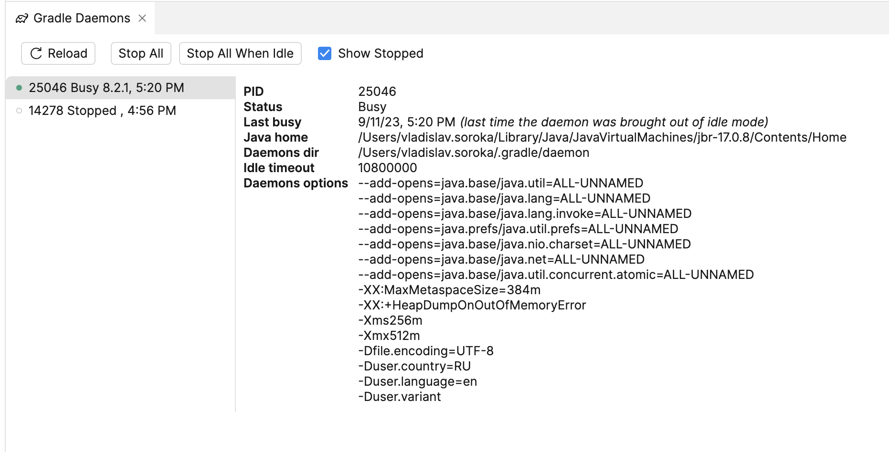

# Fleet Gradle daemon services plugin

<!--  -->

<!--  -->

<!-- Plugin description -->
**Gradle Daemons Services** is a plugin for Fleet which provides actions to view and stop Gradle daemons.
<!-- Plugin description end -->